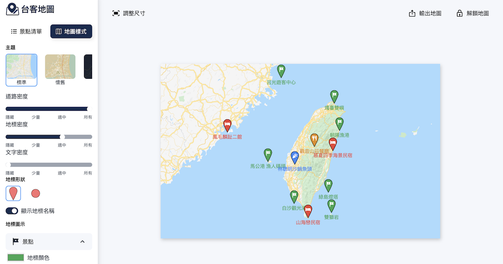

# 台客地圖 - 台灣景點地圖產生器 Taiwan Tourism Map Generator

提供給商家或是旅行團簡單好上手的地圖編輯器

[See it online](https://taiker-map.vercel.app/)

Bootstrapped with [nextjs-starter-echo template](https://github.com/Kamigami55/nextjs-starter-echo)



## features

- Next.js 12
- TailwindCSS
- Atomic design project structure
- Storybook
- Absolute import
- Hygen as code generator
- Eslint, Prettier
- Husky, lint-staged pre-commit hook

## Commands

### Start local dev server

```bash
yarn dev
```

Open [http://localhost:3000](http://localhost:3000) with your browser to see the result.

### Start Storybook component dev environment

```bash
yarn storybook
```

This command will open [http://localhost:6006](http://localhost:6006) for you, this is where you can see storybook

### Generate new component scaffold

```bash
yarn new-component
```

This calls hygen to generate new component with basic file structures, including its JS file and stories.js file

You will be prompted to select component type (atoms, molecules, organisms, templates), and then input component name
